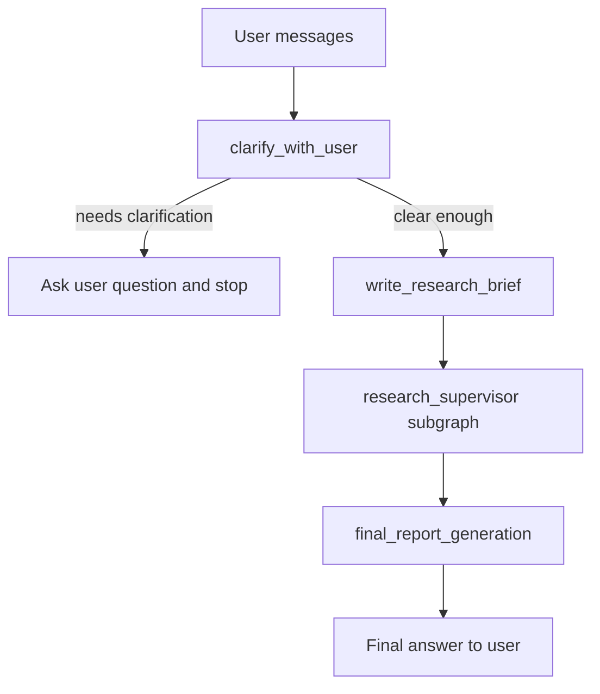
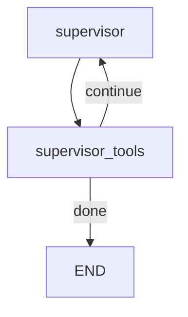
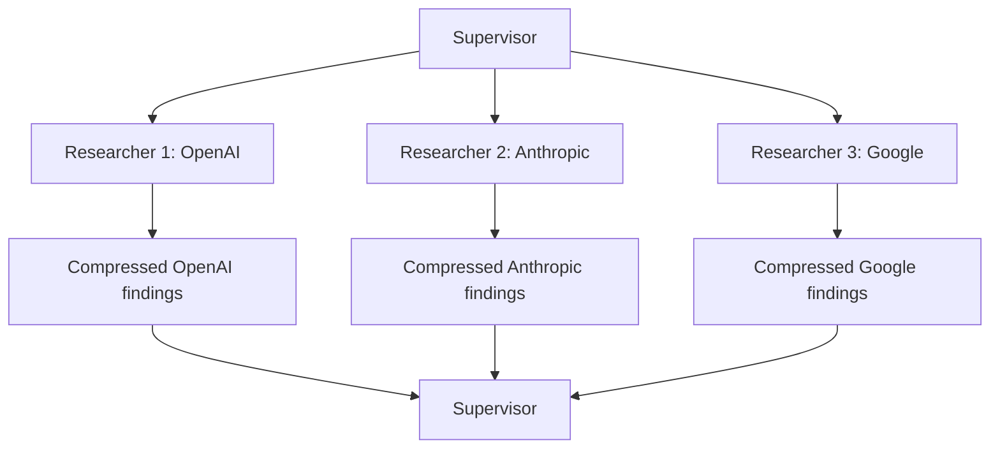
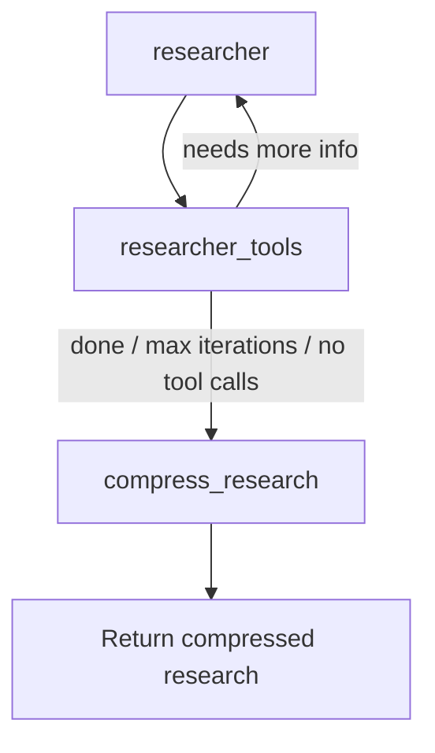
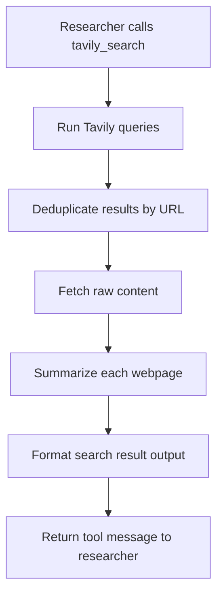
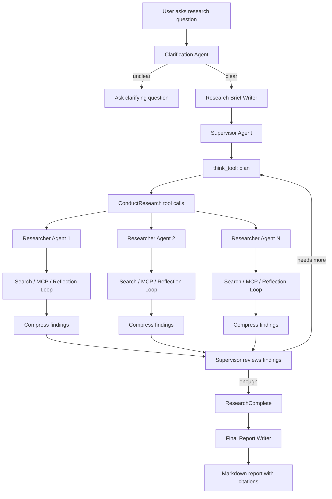
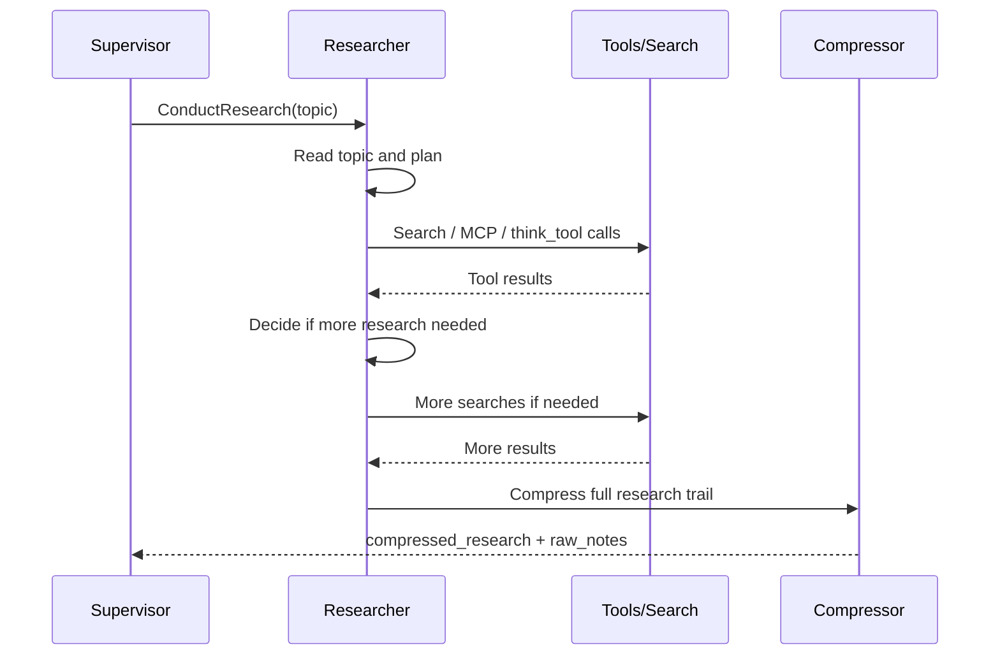

# Open Deep Research Codebase Analysis

This document explains how the **Open Deep Research** product works, with special focus on the **research agent / researcher flow**.

## 1. What this product is

This repo implements a configurable **deep research agent** using **LangGraph**.

At a high level, the product takes a user question like:

> “Compare OpenAI, Anthropic, and Google’s current AI safety approaches.”

Then it:

1. Understands whether the request is clear.
2. Converts the request into a detailed research brief.
3. Uses a **supervisor agent** to decide how to break the task into research subtasks.
4. Spawns one or more **researcher agents** to search the web / use tools.
5. Compresses each researcher’s findings.
6. Combines all findings into a final deep research report with citations.

The main implementation lives here:

```text
open_deep_research/src/open_deep_research/
├── deep_researcher.py      # Main LangGraph agent flow
├── configuration.py        # Runtime config / model / search settings
├── state.py                # State objects and structured tool schemas
├── prompts.py              # Prompts used by all agent steps
└── utils.py                # Search tools, MCP tools, token handling, helpers
```

The LangGraph entrypoint is configured in:

```text
open_deep_research/langgraph.json
```

```json
{
  "graphs": {
    "Deep Researcher": "./src/open_deep_research/deep_researcher.py:deep_researcher"
  }
}
```

So when you run LangGraph Studio, the graph named **Deep Researcher** points to the compiled graph in `deep_researcher.py`.

---

## 2. Main product flow

The main graph is built at the bottom of:

```text
open_deep_research/src/open_deep_research/deep_researcher.py
```

The main graph is:

```python
deep_researcher_builder = StateGraph(
    AgentState,
    input=AgentInputState,
    config_schema=Configuration
)

deep_researcher_builder.add_node("clarify_with_user", clarify_with_user)
deep_researcher_builder.add_node("write_research_brief", write_research_brief)
deep_researcher_builder.add_node("research_supervisor", supervisor_subgraph)
deep_researcher_builder.add_node("final_report_generation", final_report_generation)

deep_researcher_builder.add_edge(START, "clarify_with_user")
deep_researcher_builder.add_edge("research_supervisor", "final_report_generation")
deep_researcher_builder.add_edge("final_report_generation", END)

deep_researcher = deep_researcher_builder.compile()
```

So the top-level flow is:



---

## 3. Main state objects

The graph uses LangGraph state definitions in:

```text
open_deep_research/src/open_deep_research/state.py
```

### `AgentInputState`

```python
class AgentInputState(MessagesState):
    """InputState is only 'messages'."""
```

This is the external input. The user gives chat messages.

### `AgentState`

```python
class AgentState(MessagesState):
    supervisor_messages: Annotated[list[MessageLikeRepresentation], override_reducer]
    research_brief: Optional[str]
    raw_notes: Annotated[list[str], override_reducer] = []
    notes: Annotated[list[str], override_reducer] = []
    final_report: str
```

This is the main graph state.

It stores:

| Field | Purpose |
|---|---|
| `messages` | User/assistant conversation |
| `research_brief` | Clean, detailed research question |
| `supervisor_messages` | Internal messages for supervisor agent |
| `raw_notes` | Raw collected tool/agent outputs |
| `notes` | Compressed findings used for final report |
| `final_report` | Final generated report |

### `SupervisorState`

```python
class SupervisorState(TypedDict):
    supervisor_messages: Annotated[list[MessageLikeRepresentation], override_reducer]
    research_brief: str
    notes: Annotated[list[str], override_reducer] = []
    research_iterations: int = 0
    raw_notes: Annotated[list[str], override_reducer] = []
```

The supervisor keeps track of:

- what it has delegated,
- what the researchers returned,
- how many iterations it has used,
- when research is complete.

### `ResearcherState`

```python
class ResearcherState(TypedDict):
    researcher_messages: Annotated[list[MessageLikeRepresentation], operator.add]
    tool_call_iterations: int = 0
    research_topic: str
    compressed_research: str
    raw_notes: Annotated[list[str], override_reducer] = []
```

Each researcher agent has its own message history, tool-call count, topic, and compressed output.

---

## 4. Step-by-step flow

## Step 1: `clarify_with_user`

Defined in:

```text
open_deep_research/src/open_deep_research/deep_researcher.py
```

Function:

```python
async def clarify_with_user(state: AgentState, config: RunnableConfig)
```

Purpose:

Before starting expensive research, the agent checks:

> “Is the user’s request clear enough?”

It uses the prompt:

```python
clarify_with_user_instructions
```

from:

```text
open_deep_research/src/open_deep_research/prompts.py
```

The model returns structured output:

```python
class ClarifyWithUser(BaseModel):
    need_clarification: bool
    question: str
    verification: str
```

If clarification is needed:

```python
return Command(
    goto=END,
    update={"messages": [AIMessage(content=response.question)]}
)
```

So the graph stops and asks the user a clarifying question.

If no clarification is needed:

```python
return Command(
    goto="write_research_brief",
    update={"messages": [AIMessage(content=response.verification)]}
)
```

So the flow continues.

### Config involved

In `configuration.py`:

```python
allow_clarification: bool = True
```

If `allow_clarification` is `False`, the agent skips this step.

---

## Step 2: `write_research_brief`

Function:

```python
async def write_research_brief(state: AgentState, config: RunnableConfig)
```

Purpose:

It converts the original user conversation into a more detailed, explicit research brief.

Example:

User says:

> “Research AI agents in healthcare.”

The brief might become:

> “I want a comprehensive report on current AI agent applications in healthcare, including clinical decision support, patient monitoring, administrative automation, regulatory concerns, major companies, risks, and recent developments. No geography was specified, so treat the scope as global.”

It uses this prompt:

```python
transform_messages_into_research_topic_prompt
```

And structured output:

```python
class ResearchQuestion(BaseModel):
    research_brief: str
```

Then it prepares the supervisor’s starting messages:

```python
supervisor_system_prompt = lead_researcher_prompt.format(...)
```

And updates the state:

```python
"research_brief": response.research_brief,
"supervisor_messages": {
    "type": "override",
    "value": [
        SystemMessage(content=supervisor_system_prompt),
        HumanMessage(content=response.research_brief)
    ]
}
```

Then it goes to:

```python
goto="research_supervisor"
```

---

## Step 3: `research_supervisor`

This is not a single function. It is a **subgraph**.

Built here:

```python
supervisor_builder = StateGraph(SupervisorState, config_schema=Configuration)

supervisor_builder.add_node("supervisor", supervisor)
supervisor_builder.add_node("supervisor_tools", supervisor_tools)

supervisor_builder.add_edge(START, "supervisor")

supervisor_subgraph = supervisor_builder.compile()
```

The supervisor subgraph has two nodes:



The supervisor behaves like a research manager.

It does **not directly search the web**. Instead, it decides what research should be done and delegates to researcher agents.

---

## 5. Supervisor agent explained

### `supervisor`

Function:

```python
async def supervisor(state: SupervisorState, config: RunnableConfig)
```

The supervisor uses the main research model:

```python
research_model = configurable_model.bind_tools(lead_researcher_tools)
```

It has three tools:

```python
lead_researcher_tools = [ConductResearch, ResearchComplete, think_tool]
```

Those are:

| Tool | Purpose |
|---|---|
| `think_tool` | Let supervisor reflect and plan |
| `ConductResearch` | Spawn one researcher sub-agent for a topic |
| `ResearchComplete` | Tell the graph research is done |

The supervisor prompt strongly instructs it to:

1. Use `think_tool` before delegating.
2. Call `ConductResearch` for specific research tasks.
3. Reflect after results.
4. Stop once it has enough information.

The tool schemas are in `state.py`:

```python
class ConductResearch(BaseModel):
    research_topic: str

class ResearchComplete(BaseModel):
    pass
```

So when the supervisor wants research, it emits something like:

```json
{
  "name": "ConductResearch",
  "args": {
    "research_topic": "Research OpenAI's current AI safety approach..."
  }
}
```

Then the graph moves to `supervisor_tools`.

### `supervisor_tools`

Function:

```python
async def supervisor_tools(state: SupervisorState, config: RunnableConfig)
```

This function actually executes the supervisor’s tool calls.

It checks for stopping conditions:

```python
exceeded_allowed_iterations = research_iterations > configurable.max_researcher_iterations
no_tool_calls = not most_recent_message.tool_calls
research_complete_tool_call = any(
    tool_call["name"] == "ResearchComplete"
    for tool_call in most_recent_message.tool_calls
)
```

If any of those are true, it ends the supervisor subgraph and passes notes upward.

---

## 6. How supervisor launches researcher agents

The important code is:

```python
conduct_research_calls = [
    tool_call for tool_call in most_recent_message.tool_calls
    if tool_call["name"] == "ConductResearch"
]
```

For each allowed `ConductResearch` call, the system invokes the researcher subgraph:

```python
research_tasks = [
    researcher_subgraph.ainvoke({
        "researcher_messages": [
            HumanMessage(content=tool_call["args"]["research_topic"])
        ],
        "research_topic": tool_call["args"]["research_topic"]
    }, config)
    for tool_call in allowed_conduct_research_calls
]
```

Then it runs them in parallel:

```python
tool_results = await asyncio.gather(*research_tasks)
```

This is one of the most important parts of the product.

If the supervisor delegates 3 topics, it can run 3 researcher agents concurrently.

The max parallelism is controlled by:

```python
max_concurrent_research_units: int = 5
```

in `configuration.py`.

So the supervisor can do this:



Each researcher returns:

```python
{
    "compressed_research": "...",
    "raw_notes": [...]
}
```

The supervisor receives those compressed outputs as tool messages.

---

## 7. Researcher agent explained

The researcher subgraph is built here:

```python
researcher_builder = StateGraph(
    ResearcherState,
    output=ResearcherOutputState,
    config_schema=Configuration
)

researcher_builder.add_node("researcher", researcher)
researcher_builder.add_node("researcher_tools", researcher_tools)
researcher_builder.add_node("compress_research", compress_research)

researcher_builder.add_edge(START, "researcher")
researcher_builder.add_edge("compress_research", END)

researcher_subgraph = researcher_builder.compile()
```

Its flow:



The researcher is the actual “worker” agent that searches and gathers evidence.

### Researcher node: `researcher`

Function:

```python
async def researcher(state: ResearcherState, config: RunnableConfig)
```

This function:

1. Loads all available tools.
2. Builds the researcher prompt.
3. Calls the research model with tools bound.
4. Produces tool calls.

Important code:

```python
tools = await get_all_tools(config)
```

The tools come from `utils.py`.

The researcher can use:

- `ResearchComplete`
- `think_tool`
- search tools, usually `tavily_search`
- OpenAI native web search
- Anthropic native web search
- MCP tools, if configured

Then:

```python
research_model = configurable_model.bind_tools(tools)
```

The researcher prompt is:

```python
research_system_prompt
```

It tells the researcher:

- Start broad.
- Search.
- Reflect with `think_tool`.
- Search narrower if needed.
- Stop when enough evidence is gathered.
- Avoid endless searching.

### Researcher tools node: `researcher_tools`

Function:

```python
async def researcher_tools(state: ResearcherState, config: RunnableConfig)
```

This function runs whatever tools the researcher called.

It first checks:

```python
has_tool_calls = bool(most_recent_message.tool_calls)
has_native_search = (
    openai_websearch_called(most_recent_message) or
    anthropic_websearch_called(most_recent_message)
)
```

If the researcher made no tool calls and no native web search occurred:

```python
return Command(goto="compress_research")
```

So research ends.

Otherwise, it executes tools:

```python
tool_execution_tasks = [
    execute_tool_safely(tools_by_name[tool_call["name"]], tool_call["args"], config)
    for tool_call in tool_calls
]

observations = await asyncio.gather(*tool_execution_tasks)
```

So if the researcher calls multiple searches, those can run in parallel.

It then checks:

```python
exceeded_iterations = state.get("tool_call_iterations", 0) >= configurable.max_react_tool_calls
research_complete_called = any(
    tool_call["name"] == "ResearchComplete"
    for tool_call in most_recent_message.tool_calls
)
```

If max iterations or `ResearchComplete`, it goes to compression.

Otherwise, it loops back to `researcher`.

---

## 8. Search tool flow

The main custom search tool is in:

```text
open_deep_research/src/open_deep_research/utils.py
```

Tool:

```python
@tool(description=TAVILY_SEARCH_DESCRIPTION)
async def tavily_search(...)
```

The Tavily flow:



Important behavior:

1. The researcher passes a list of queries.
2. `tavily_search_async` runs those queries.
3. Results are deduplicated by URL.
4. Each page’s raw content is summarized using the `summarization_model`.
5. Search results are returned in a structured format with URLs and summaries.

The summarization prompt is:

```python
summarize_webpage_prompt
```

This helps reduce noisy raw webpage content before giving it back to the researcher.

---

## 9. Tool configuration

Tool setup happens in:

```python
async def get_all_tools(config: RunnableConfig)
```

in `utils.py`.

It starts with:

```python
tools = [tool(ResearchComplete), think_tool]
```

Then adds search tools:

```python
search_api = SearchAPI(get_config_value(configurable.search_api))
search_tools = await get_search_tool(search_api)
tools.extend(search_tools)
```

Supported search APIs are defined in `configuration.py`:

```python
class SearchAPI(Enum):
    ANTHROPIC = "anthropic"
    OPENAI = "openai"
    TAVILY = "tavily"
    NONE = "none"
```

So the research agent can use:

| Search API | How it works |
|---|---|
| `tavily` | Uses custom `tavily_search` tool |
| `openai` | Uses OpenAI native web search |
| `anthropic` | Uses Anthropic native web search |
| `none` | No search tool |

Then MCP tools are optionally added:

```python
mcp_tools = await load_mcp_tools(config, existing_tool_names)
tools.extend(mcp_tools)
```

MCP support lets the agent use external tools from Model Context Protocol servers.

---

## 10. Compression step

After a researcher finishes searching, it does not directly write the final answer.

Instead, it compresses its findings using:

```python
async def compress_research(state: ResearcherState, config: RunnableConfig)
```

Purpose:

Take the full researcher conversation:

- AI messages
- search results
- tool outputs
- reflections

and turn them into a cleaner research packet.

The compression prompt is:

```python
compress_research_system_prompt
```

Important instruction:

> Do not summarize away important information. Preserve all relevant facts and sources.

The output format is supposed to include:

```text
**List of Queries and Tool Calls Made**
**Fully Comprehensive Findings**
**List of All Relevant Sources**
```

This compressed research is returned to the supervisor.

---

## 11. Final report generation

After the supervisor decides research is complete, control returns to the main graph:

```python
deep_researcher_builder.add_edge("research_supervisor", "final_report_generation")
```

Function:

```python
async def final_report_generation(state: AgentState, config: RunnableConfig)
```

This function:

1. Takes all compressed notes.
2. Takes the original research brief.
3. Takes the original user messages.
4. Asks the final report model to produce a polished report.

It uses:

```python
final_report_generation_prompt
```

The final report prompt requires:

- same language as the user,
- markdown headings,
- detailed answer,
- balanced analysis,
- citations,
- final `Sources` section.

Final output is added to messages:

```python
return {
    "final_report": final_report.content,
    "messages": [final_report],
    **cleared_state
}
```

So the user sees the final report as the assistant’s answer.

---

## 12. Full end-to-end architecture



---

## 13. Important configuration options

Defined in:

```text
open_deep_research/src/open_deep_research/configuration.py
```

### General

```python
allow_clarification: bool = True
```

Controls whether the agent asks clarifying questions.

```python
max_structured_output_retries: int = 3
```

Retries structured-output model calls.

### Research parallelism

```python
max_concurrent_research_units: int = 5
```

Maximum number of researcher agents the supervisor can run at once.

Example:

If the supervisor calls `ConductResearch` 8 times but the limit is 5, only 5 run. The rest receive an error message.

### Supervisor iterations

```python
max_researcher_iterations: int = 6
```

Despite the name, this controls how many supervisor research/reflection cycles can happen.

### Researcher tool loop

```python
max_react_tool_calls: int = 10
```

Maximum number of tool-calling iterations inside a single researcher.

### Models

```python
summarization_model = "openai:gpt-4.1-mini"
research_model = "openai:gpt-4.1"
compression_model = "openai:gpt-4.1"
final_report_model = "openai:gpt-4.1"
```

The product uses different models for different jobs:

| Model setting | Used for |
|---|---|
| `summarization_model` | Summarizing raw webpage content |
| `research_model` | Clarification, research brief, supervisor, researcher |
| `compression_model` | Cleaning researcher findings |
| `final_report_model` | Writing final report |

---

## 14. API keys and environment

API key lookup is in:

```python
get_api_key_for_model(...)
get_tavily_api_key(...)
```

By default it reads from environment variables:

```text
OPENAI_API_KEY
ANTHROPIC_API_KEY
GOOGLE_API_KEY
TAVILY_API_KEY
```

But if:

```text
GET_API_KEYS_FROM_CONFIG=true
```

then it reads keys from LangGraph/OAP config:

```python
config["configurable"]["apiKeys"]
```

This allows hosted UI users to provide their own keys.

---

## 15. Authentication layer

There is a deployment auth module:

```text
open_deep_research/src/security/auth.py
```

It uses Supabase JWT auth.

The LangGraph config points to it:

```json
"auth": {
  "path": "./src/security/auth.py:auth"
}
```

This file:

1. Validates bearer tokens with Supabase.
2. Adds ownership metadata to threads and assistants.
3. Ensures users can only access their own threads, assistants, and store data.

This matters mostly for hosted deployment / Open Agent Platform usage.

---

## 16. What exactly is the “researcher agent”?

The researcher agent is a LangGraph subgraph that does focused research on one topic.

It is composed of three nodes:

```text
researcher
researcher_tools
compress_research
```

### Its lifecycle



### It can use tools

The researcher can call:

```python
ResearchComplete
think_tool
tavily_search / native web search / MCP tools
```

### It loops

It can repeatedly:

1. Think.
2. Search.
3. Read results.
4. Search again.
5. Stop.

Until:

- it calls `ResearchComplete`,
- it hits `max_react_tool_calls`,
- or it stops making tool calls.

Then it compresses findings and returns them.

---

## 17. Why there is both a supervisor and researcher

This is the key product design.

The system separates **planning** from **evidence gathering**.

### Supervisor responsibilities

The supervisor decides:

- What subtopics matter?
- Can they run in parallel?
- Is the research complete?
- Are there missing angles?

It does not directly search.

### Researcher responsibilities

Each researcher handles:

- one focused topic,
- searches,
- tool usage,
- source collection,
- raw evidence gathering,
- compressed findings.

This separation makes the system more scalable and controllable.

Example:

For a comparison query:

> “Compare OpenAI, Anthropic, and Google on AI safety.”

The supervisor may create three researchers:

```text
Researcher 1: OpenAI AI safety strategy
Researcher 2: Anthropic AI safety strategy
Researcher 3: Google DeepMind AI safety strategy
```

Then the final report writer merges the results.

---

## 18. Important implementation detail: parallelism

The product uses `asyncio.gather` in two important places.

### Supervisor runs researchers in parallel

```python
tool_results = await asyncio.gather(*research_tasks)
```

So multiple sub-researchers can run at the same time.

### Researcher runs tool calls in parallel

```python
observations = await asyncio.gather(*tool_execution_tasks)
```

So one researcher can execute multiple tool calls at once.

This is why the product can feel faster than a purely sequential research workflow.

---

## 19. Token limit handling

There are helper functions in `utils.py`:

```python
is_token_limit_exceeded(...)
get_model_token_limit(...)
remove_up_to_last_ai_message(...)
```

The system tries to recover from large context failures.

### During compression

If compression hits token limits, it removes some older message history and retries.

### During final report generation

If final report generation hits token limits, it progressively truncates findings and retries.

This is practical because deep research can accumulate a lot of search output.

---

## 20. Legacy implementations

The repo also has:

```text
open_deep_research/src/legacy/
```

According to `README.md`, there are two older approaches:

### `legacy/graph.py`

A plan-and-execute workflow with human-in-the-loop planning.

### `legacy/multi_agent.py`

A supervisor-researcher architecture, but older than the current implementation.

The current main product is:

```text
src/open_deep_research/deep_researcher.py
```

---

## 21. How to run locally

From the README:

```bash
uv venv
source .venv/bin/activate
uv sync
cp .env.example .env
```

Then add API keys to `.env`.

Start LangGraph server:

```bash
uvx --refresh --from "langgraph-cli[inmem]" --with-editable . --python 3.11 langgraph dev --allow-blocking
```

Then open LangGraph Studio.

The graph exposed is:

```text
Deep Researcher
```

You submit a `messages` input and can change config through the UI.

---

## 22. Product summary in plain English

Open Deep Research works like a small research team:

| Role | Code | What it does |
|---|---|---|
| Intake assistant | `clarify_with_user` | Checks if the request is clear |
| Research brief writer | `write_research_brief` | Converts chat into a proper research task |
| Research manager | `supervisor` | Plans and delegates research |
| Tool executor for manager | `supervisor_tools` | Runs supervisor tool calls |
| Research worker | `researcher` | Searches and gathers evidence |
| Tool executor for worker | `researcher_tools` | Runs searches/MCP/tools |
| Research cleaner | `compress_research` | Preserves findings in clean format |
| Report writer | `final_report_generation` | Writes final markdown report |

The core architecture is:

```text
User question
  ↓
Clarify
  ↓
Research brief
  ↓
Supervisor plans
  ↓
Researchers search in parallel
  ↓
Compressed findings
  ↓
Supervisor decides if enough
  ↓
Final report
```

The “research agent” specifically is the `researcher_subgraph`, which performs focused search/tool loops and returns compressed evidence to the supervisor.
